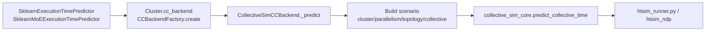

# collective-sim

## Modification History

| Date       | Summary of Changes |
|------------|--------------------|
| 2026-03-08 | Add Frontier integration guide: call chain, required parameters, workflow, and domain mapping notes. |

`collective-sim` is a compact collective-time prediction layer for modern GPU server scenarios.
It is **modified from htsim** (`csg-htsim`) and keeps the original network simulation core while adding a cleaner integration API for external simulators.

## Quick Start

```bash
cd sim && make -j$(nproc)
python examples/quickstart.py       # basic usage patterns (allreduce/allgather/alltoall)
python examples/nccl_alltoall.py    # NCCL pairwise vs full-mesh AllToAll (MoE EP traffic)
```

## Integration Docs

- English: `docs/integration_api.md`
- 中文: `docs/接入指南_中文.md`

## Frontier → collective-sim Call Chain

Frontier integrates `collective-sim` through `CollectiveSimCCBackend`.
The typical call chain is:



Relevant Frontier files:

- `frontier/entities/cluster.py`: materializes runtime topology into backend config.
- `frontier/cc_backend/backends/collective_sim_cc_backend.py`: per-call layout selection and scenario assembly.
- `frontier/execution_time_predictor/sklearn_execution_time_predictor.py`: TP / DP / PP communication callers.
- `frontier/execution_time_predictor/sklearn_moe_execution_time_predictor.py`: MoE TP / EP communication callers.

## Required Inputs When Using collective-sim Directly

The minimal scenario expected by `predict_collective_time(...)` is:

- `cluster.servers`
- `cluster.gpus_per_server`
- `parallelism.tp/cp/dp/ep`
- `topology.kind` and its required topology parameters
- `collective.kind`
- `collective.tensor_bytes`
- `collective.domain_dims`
- `collective.placement_order`

Optional but commonly used fields:

- `network.*`: NIC/link parameters
- `intra_server.*`: intra-server model selection
- `collective.allreduce_model`
- `collective.allgather_model`
- `collective.reducescatter_model`
- `collective.alltoall_model`
- `collective.nchannels`
- `collective.participant_ranks`
- `collective.p2p_src_index` / `collective.p2p_dst_index` / `collective.p2p_direction`

See `docs/integration_api.md` for the external API contract.

## How Frontier Fills Those Inputs

Frontier does **not** rebuild the whole simulator topology per feature. Instead, it materializes a
full topology once and then fills a dynamic `collective` spec per communication event.

### Runtime parallel layouts used by Frontier

- **Attention layout**
  - `TP = attn_tensor_parallel_size`
  - `CP = num_pipeline_stages`
  - `DP = attn_data_parallel_size * num_replicas`
  - `EP = 1`
- **MoE layout**
  - `TP = moe_tensor_parallel_size`
  - `CP = num_pipeline_stages`
  - `DP = num_replicas`
  - `EP = moe_expert_parallel_size`

`CollectiveSimCCBackend` chooses between these two layouts **per call** based on
`comm_domain`, cluster type, and participant count.

## Domain Mapping Used by Frontier

`collective-sim` uses a 4-D layout: `TP / CP / DP / EP`.
Frontier therefore maps its communication domains as follows:

| Frontier comm_domain | collective-sim dim | Meaning |
|---|---|---|
| `TP` | `TP` | Tensor-parallel subgroup |
| `DP` | `DP` | Data-parallel subgroup |
| `EP` | `EP` | Expert-parallel subgroup |
| `PP` | `CP` | Pipeline proxy dimension |

`PP -> CP` is intentional: `collective-sim` has no native `PP` dimension, so Frontier reuses `CP`
as a **pipeline proxy dimension** for point-to-point pipeline traffic.

## participant_ranks and nchannels in Frontier

### participant_ranks

Frontier always keeps the **full topology** in `parallelism`, then selects the active subgroup with
explicit `participant_ranks`.

This is important because a domain like `DP` or `EP` may have many groups in the full layout, while
one communication event usually targets **one concrete subgroup**, not all groups at once.

`participant_ranks` is built by:

1. choosing the per-call layout,
2. using `placement_order` to compute rank strides,
3. fixing all non-target dimensions to `0`,
4. enumerating the target domain dimension from `0..participant_count-1`,
5. linearizing the coordinates into global ranks.

### nchannels

Frontier forwards `nchannels` from `CollectiveSimCCBackendConfig` into the collective spec.
Current Frontier default is `8`.

Important: in `htsim_runner.py`, `nchannels` is only used by `nccl_ring` models.
For `ring_steps`, it is ignored.

## Current Frontier Default Algorithm Policy

Frontier currently uses a conservative default policy:

| Collective kind | Frontier default |
|---|---|
| `allreduce` | `ring_steps` |
| `allgather` | `ring_steps` |
| `reducescatter` | `ring_steps` |
| `alltoall` | `pairwise_steps` |

This is a **Frontier-side default policy**, not a special implicit mode inside the backend.
It is chosen to remain backward-compatible with earlier numerical expectations.

More NCCL-oriented alternatives supported by the runner include:

- `nccl_ring` for `allreduce` / `allgather` / `reducescatter`
- `nccl_pairwise` for `alltoall`
- `hierarchical` / `hierarchical_ring` for `allgather` / `reducescatter`

Whether to switch the defaults is a modeling-policy decision, not an integration correctness issue.

## Basic Frontier Workflow

For each communication-time query:

1. `Cluster` materializes runtime topology into `CollectiveSimCCBackendConfig`.
2. Predictor calls the CC backend with `kind`, `tensor_bytes`, `num_devices`, and `comm_domain`.
3. Backend normalizes domain names (`PP -> CP`).
4. Backend selects attention layout or MoE layout for this call.
5. Backend computes explicit `participant_ranks`.
6. Backend assembles the `scenario` dictionary.
7. `collective_sim_core.predict_collective_time(...)` runs the runner and returns predicted time.
8. Frontier caches the result by `(kind, tensor_bytes, mapped_domain, participant_ranks, dims)`.

## Representative Frontier Cases

- **Attention DP allreduce**
  - `comm_domain="DP"`
  - uses attention layout
  - active subgroup selected by `participant_ranks`

- **Pipeline send/recv**
  - `comm_domain="PP"` → mapped to `CP`
  - `kind="p2p"`
  - forwards `p2p_src_index`, `p2p_dst_index`, and `p2p_direction`

- **DECODE_FFN EP all_to_all**
  - `comm_domain="EP"`
  - uses MoE layout
  - models expert-parallel exchange over explicit EP participants
